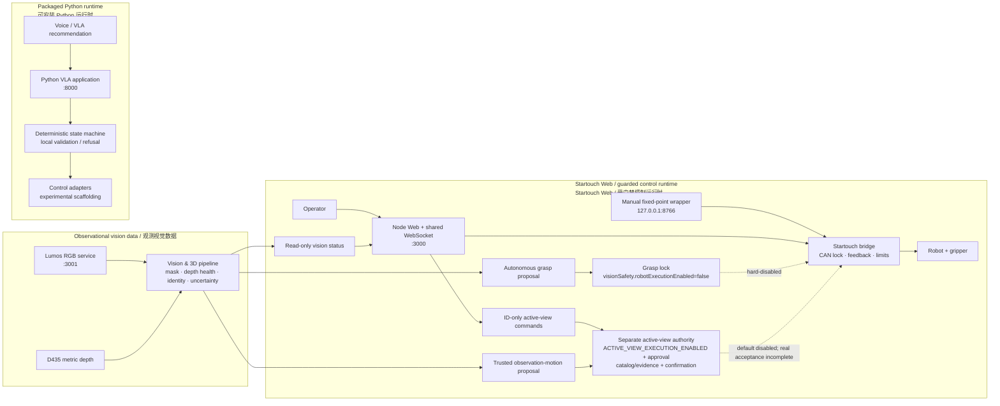

<div align="center">

# ThirdHand VLA

**A safety-bounded research platform for visual/3D robotic perception, verifiable VLA candidates, and reproducible evidence.**<br>
**面向视觉/三维机器人感知、可验证 VLA 候选与可复现实验证据的安全边界研究平台。**

[](pyproject.toml)
[](LICENSE)

[](.github/workflows)

**[中文教程 / Chinese tutorial](README_CN.md)** · **[English tutorial](README_EN.md)**

</div>

> **Safety status / 安全状态：** Autonomous vision-triggered grasping remains
> **Planned**: the grasp path is hard-locked by `visionSafety.robotExecutionEnabled=false`
> and `robot_execution_enabled: false`. Active-view observation motion is a separate
> **Implemented / Experimental** path. It is default-disabled and requires its own runtime
> switch, approval, catalog/evidence, and per-step confirmation; it has **not** passed real-hardware
> acceptance. 自主视觉抓取仍为 **Planned**；主动视角观测运动是另一条已实现但实验性的权限链，
> 默认关闭，须同时通过独立开关、审批、目录/证据与逐步确认，且尚未完成真机验收。

## Research focus / 研究主轴

| Track | What the repository supports now | Research position |
| --- | --- | --- |
| **Vision & 3D / 视觉与三维** | Lumos RGB, D435 depth health, instance masks, identity memory, uncertainty-aware gating, and read-only online observation. | **Primary / 主轴** — calibrated 3D and comparative study evidence remain incomplete. |
| **Verifiable VLA / 可验证 VLA** | Structured candidates, local preview, confirmation, deterministic validation, refusal, timeout, and recovery interfaces. | **Secondary / 次轴** — candidate generation is not robot authority. |
| **Safe Execution Platform / 安全执行平台** | Packaged console, Startouch web stack, fixed-point demo, safety/state-machine boundaries, and port separation. | **Platform / 平台** — a supervised boundary, not the paper's principal claim. |
| **Reproducible Evidence / 可复现实验证据** | Claim, dataset, baseline, figure, and reproducibility templates with machine-readable schemas. | **Evidence contract / 证据契约** — no planned figure is a result. |

### Maturity legend / 成熟度图例

| Level | Meaning |
| --- | --- |
| **Implemented / 已实现** | Code or documented interface exists in this repository. |
| **Verified / 已验证** | A linked, scoped test or dated measurement supports the stated behavior. |
| **Experimental / 实验性** | Usable for bounded research/Dry Run evaluation; not a validated general capability. |
| **Planned / 计划中** | A protocol, schema, or intended artifact exists, but no result is claimed. |

### Capability status / 能力状态

| Capability | Maturity | Repository evidence | Boundary / interpretation |
| --- | --- | --- | --- |
| Dual-camera perception and persistent identity | **Experimental** | [dated REMIND-3D deployment record](docs/vision_research/REMIND3D_DEPLOYMENT_RESULTS.md) | Lumos is canonical RGB; D435 supplies metric-depth health. Missing calibration keeps targets non-actionable. |
| Read-only online Dry Run | **Verified** | [2026-08-05 deployment record](docs/vision_research/REMIND3D_DEPLOYMENT_RESULTS.md) | The record states `robot_execution_enabled: false`; no CAN, Startouch, robot, or gripper I/O belongs to this vision path. |
| Active-view observation-motion control path | **Implemented / Experimental** | [controller](web-control/server/active-view-controller.js), [authorization](web-control/server/active-view-authorization.js), and ID-only browser protocol | Default-disabled and fail-closed; real observation motion has not passed hardware acceptance. |
| Autonomous vision-triggered grasp | **Planned** | The grasp authorizer exists, but `visionSafety.robotExecutionEnabled` remains hard-disabled. | No tutorial or result authorizes an autonomous grasp. |
| Candidate → preview → validation/refusal boundary | **Implemented** | [Verifiable VLA track](docs/research/README.md) | It constrains a proposed decision before robot authority; no VLA comparison result is represented. |
| Comparative figures and paper claims | **Planned** | [figure manifest](docs/research/figure_manifest.md) | Each listed figure needs source artifacts and a reproducible generation command. |

<!-- ACTIVE-VIEW-SAFETY:BEGIN -->
| Contract key | Capability and maturity | Default lock | Additional authority | Hardware acceptance |
| --- | --- | --- | --- | --- |
| `grasp-lock` | Autonomous vision-triggered grasp is <code>maturity:Planned</code>. | <code>visionSafety.robotExecutionEnabled=false</code>; checked-in vision configuration keeps <code>robot_execution_enabled:false</code>. | No vision or VLA candidate can bypass the grasp authorizer. | No validated autonomous grasp. |
| `active-view-motion` | Observation-motion control is <code>maturity:Implemented/Experimental</code>. | Default disabled; the safe launcher fixes <code>ACTIVE_VIEW_EXECUTION_ENABLED=0</code>. | Requires <code>authority:approval+catalog+evidence+confirmation</code>, fresh correlated IDs, robot state, and hard motion bounds. | <code>real-hardware-accepted:false</code>; do not infer acceptance from simulation. |
<!-- ACTIVE-VIEW-SAFETY:END -->

## Architecture / 系统边界



The two runtimes do not share an implicit authority switch. Grasp remains locked, while an
active-view proposal can reach the bridge only through its separate fail-closed authorization
chain. The currently shipped code/interface does not make that path accepted for real hardware.

<!-- ACTIVE-VIEW-WS-COMMANDS:BEGIN -->
The shared Startouch WebSocket accepts exactly these three active-view client commands. Payloads
are ID-only: browsers cannot submit coordinates, joints, or robot commands.

| Command | Exact allowed client keys | Meaning |
| --- | --- | --- |
| `start_active_view` | `cmd`, `identityId` (non-negative integer); <code>keys:cmd+identityId</code> | Ask the server to create a session for a fresh, confirmed identity. |
| `confirm_active_view_step` | `cmd`, `sessionId`, `proposalId` (UUIDs); <code>keys:cmd+sessionId+proposalId</code> | Confirm only the server-held pending proposal. |
| `cancel_active_view` | `cmd`, `sessionId` (UUID); <code>keys:cmd+sessionId</code> | Cancel the shared session. |

There is <code>authentication:none</code>, <code>per-client-ownership:none</code>, and
<code>session-scope:shared</code>. Any connected client can start, confirm, or cancel the shared
active-view session and can affect other clients; use only on a controlled network.
<!-- ACTIVE-VIEW-WS-COMMANDS:END -->

<!-- L4-EXECUTABLE-RECOMMENDATION:BEGIN -->
The tutorial's only L4 executable recommendation is the fixed-point wrapper in its default manual
mode:

```bash
bash scripts/demo_fixed_pick_place.sh
```
<!-- L4-EXECUTABLE-RECOMMENDATION:END -->

<!-- L4-PROHIBITIONS:BEGIN -->
The command `bash scripts/open_fixed_pick_place_control.sh` opens the `127.0.0.1:8766` UI but is
listed here only as a prohibition (<code>prohibited:open-fixed-ui</code>). `/api/start-auto`
(<code>prohibited:start-auto</code>) and direct real-mode use of
`web-control/scripts/fixed_pick_place.py` (<code>prohibited:raw-real-runner</code>) are also
prohibition context only. They are not tutorial L4 entry points. The automatic route lacks an implementation-level
fail-closed gate, and the raw runner bypasses wrapper-only preflight. Do not use them for real L4
motion or run competing CAN controllers.

这些接口仅在禁止说明中出现：真实 L4 只推荐上述默认 `manual` 包装脚本。
<!-- L4-PROHIBITIONS:END -->

See [architecture details](docs/architecture.md),
[fixed-point safety instructions](web-control/FIXED_PICK_PLACE.md), and the detailed
[Chinese](README_CN.md#tutorial-07-hands-on) / [English](README_EN.md#tutorial-07-hands-on)
L4 tutorials.

## Safe quick start / 安全快速开始

Python 3.10+ is required. This is the shortest offline L0/L1 verification path:

```bash
git clone https://github.com/Chenxi-Li24/UIEAclub_ThirdHand_VLA.git
cd UIEAclub_ThirdHand_VLA
python3 -m venv .venv
. .venv/bin/activate
python -m pip install --upgrade pip
pip install -e ".[core,dev]"
ruff check src/ tests/
mypy src/
STARTOUCH_CAN_INTERFACE=thirdhand-test pytest tests/ -q --ignore=tests/e2e/
```

These commands install and test local software only; they **do not authorize hardware
motion**. Keep the physical emergency stop available before any separately approved
hardware procedure. For service-specific setup, read the [architecture](docs/architecture.md),
[web-control guide](web-control/README.md), and [model/runtime-data notes](docs/model_assets.md).

## GPT image-language grounding preview / GPT 图像语言目标预览

This repository now contains an **Implemented / offline-verified** multimodal grounding path for
requests such as `夹取可乐`. It selects one identity from the current, confirmed vision candidates
and highlights that ID in the browser. It does **not** call the grasp authorizer, robot bridge,
gripper, active-view controller, or camera command channel.

```text
夹取可乐
  → paired ID-labelled JPEG + frame provenance
  → server-side strict image/text request
  → select / clarify / none
  → fresh confirmed-ID revalidation
  → bounded hash/ID audit (no JPEG or API key)
  → requester-only browser highlight (preview)
  ⇛ no execution edge; autonomous grasp remains locked
```

### Reusable vision SDK and offline parity / 可复用视觉 SDK 与离线一致性

Install the hardware-free SDK into the pinned vision environment without replacing its existing
CUDA/model dependency set:

```bash
/home/nieqingcao/miniconda3/envs/thirdhand-remind3d/bin/python \
  -m pip install --no-deps -e packages/thirdhand-vision-sdk
(cd packages/thirdhand-vision-sdk && \
  /home/nieqingcao/miniconda3/envs/thirdhand-remind3d/bin/python -m pytest tests -q)
/home/nieqingcao/miniconda3/envs/thirdhand-remind3d/bin/python \
  packages/thirdhand-vision-sdk/examples/minimal_mock.py
```

Build and inspect the independent wheel/source distribution:

```bash
/home/nieqingcao/miniconda3/envs/thirdhand-remind3d/bin/python -m pip install build
/home/nieqingcao/miniconda3/envs/thirdhand-remind3d/bin/python \
  -m build packages/thirdhand-vision-sdk
```

Before selecting the SDK as the primary runtime, compare independently generated legacy and SDK
JSONL results using the preregistered thresholds in
[`configs/vision/sdk_replay_parity.yaml`](configs/vision/sdk_replay_parity.yaml):

Each line is one frame object containing `frame_id`, `blockers`, and `targets`. Every target must
include its frame-local `detection_id`, a persistent `correspondence_id`, `label`, `identity_id`,
`descriptor`, and optional pose. The minimum target shape is:

```json
{
  "detection_id": 3,
  "correspondence_id": "physical-object:coke-1",
  "label": "bottle",
  "identity_id": 12,
  "descriptor": [0.6, 0.8],
  "pose": null
}
```

`correspondence_id` is evaluation evidence, not a model output. Assign it independently from a
physical marker, dataset object key, or blinded manual annotation; keep it stable across occlusion
and use the same key in both streams. Never derive it from either implementation's `identity_id`
or frame-local `detection_id`, because doing so leaks the result into the metric. Each stream's
`descriptor` must be the actual finite embedding produced with the preregistered encoder version,
normalization, and crop policy. Do not copy one stream's descriptor into the other. Missing
descriptors fail closed, and a replay with zero paired descriptor samples reports
`descriptor_pairs_missing` instead of claiming zero descriptor error.

中文说明：`correspondence_id` 必须来自独立标注或物理对象真值，并在“出现—遮挡—重现”期间保持不变；
不能用任一待比较算法输出的身份 ID 或逐帧检测 ID 代替。两个结果流分别保存其真实 descriptor，且至少
形成一组有效配对，否则一致性门禁不会通过。

```bash
PYTHONPATH=packages/thirdhand-vision-sdk/src:web-control/server \
  /home/nieqingcao/miniconda3/envs/thirdhand-remind3d/bin/python \
  scripts/vision/run_sdk_replay_parity.py \
  --legacy artifacts/vision/parity/legacy.jsonl \
  --sdk artifacts/vision/parity/sdk.jsonl \
  --config configs/vision/sdk_replay_parity.yaml \
  --output artifacts/vision/parity/report.json
```

A missing/malformed input or exceeded threshold exits non-zero. Passing this offline gate does not
authorize online shadow deployment, algorithm removal, or physical execution.

### Provider modes and API boundary / 提供方模式与 API 边界

| Mode | Start command | Network | Intended use |
| --- | --- | --- | --- |
| Disabled (default) | `node web-control/server/proxy.js` | None from grounding | Production-safe default; returns `provider_unavailable`. |
| Deterministic mock | `VLA_PROVIDER=mock node web-control/server/proxy.js` | None | UI/protocol integration and CI; never a performance result. |
| OpenAI | `VLA_PROVIDER=openai node web-control/server/proxy.js` | Responses API only | Server-side image/text grounding after API billing and secret setup. |

OpenAI mode reads `OPENAI_API_KEY` only from the **server process environment**. Inject it with the
deployment secret manager before starting the process; never paste a real key into chat, the
browser, source files, Git, screenshots, logs, fixtures, or shell history. The official
[developer quickstart](https://developers.openai.com/api/docs/quickstart#create-and-export-an-api-key)
documents environment-based key loading, and the
[vision guide](https://developers.openai.com/api/docs/guides/images-vision) documents image input
to the Responses API. A ChatGPT subscription/workspace allowance does not govern Platform API
billing; these are separate controls, as described in OpenAI's
[usage-control boundary](https://learn.chatgpt.com/docs/enterprise/governance#related-chatgpt-usage-controls).
API availability, quota and spend limits remain account/project/region dependent; keep the default
disabled when access is unavailable.

Server-owned configuration:

| Variable | Default | Bound / meaning |
| --- | --- | --- |
| `VLA_PROVIDER` | `disabled` | Exact allowlist: `disabled`, `mock`, `openai`. |
| `VLA_MODEL` | `gpt-5.6-terra` | Server-only model ID; never accepted from the browser. |
| `VLA_TIMEOUT_MS` | `8000` | Clamped to 1,000–30,000 ms. |
| `VLA_AUDIT_LOG` | `artifacts/vision/vla-grounding/events.jsonl` | Append-only, mode `0600`, bounded canonical JSONL. |

The browser sends exactly `{cmd:"ground_language_target",query}`. The server adds a fixed prompt,
the paired ID-labelled JPEG and a strict schema whose selectable IDs come only from fresh,
confirmed detections. The returned ID is revalidated against the newest frame before preview.
Missing credentials, malformed responses, timeouts, stale evidence, changed IDs, audit failures,
disconnects and vision failures all fail closed.

### Expected preview and research record / 预期预览与科研记录

With fresh candidates 12 and 15, entering `夹取可乐` produces `analyzing`, followed by one of
`selected`, `clarify`, `none`, `rejected`, or `error`. A selected result highlights only the
matching detection card and always displays `GPT 仅选择已有视觉 ID：预览，不会执行抓取。`

Each terminal decision records request/query, provider/model, prompt/schema version, frame ID,
monotonic timestamp, image SHA-256, allowed identity IDs, decision, selected ID, ambiguity,
explanation, semantic score, validation/reason, latency and token usage. The JPEG and API key are
never written to this log. `semanticScore` is provider analysis data for later calibration and
ablation; it is **not a safety confidence**, grasp authorization, or evidence that the robot moved.
The fixture [`tests/fixtures/vla/coke-selection.json`](tests/fixtures/vla/coke-selection.json) and
`vla-preview` CI job reproduce the preview without network, camera, GPU, CAN, Startouch or gripper.

<!-- ACTIVE-VIEW-L2-DEMO:BEGIN -->
For the active-view state machine, the only landing-page demonstration is the deterministic,
loopback browser simulation below. It is <code>authority:L2-only</code> with
<code>actuator-transport:none</code>: it does not connect cameras, CAN, the robot, or the gripper.

```bash
bash scripts/vision/start_active_view_demo.sh
```
<!-- ACTIVE-VIEW-L2-DEMO:END -->

## Evidence preview / 证据预览

The [research evidence hub](docs/research/README.md) separates measured records from
future artifacts. `Planned Evidence / 待补实验证据` means no result exists.
`Evidence Incomplete / 待补充证据` is reserved for a partial result whose sample
count, confidence interval, statistical method, or source evidence is absent,
inadequate, or untraceable. Protocol readiness is recorded separately from evidence
status.

### Planned figure registry / 计划图表登记

All entries below are **Planned Evidence**: they are future artifacts, not measurements, and no
result exists for any row. The [full figure manifest](docs/research/figure_manifest.md) is the
canonical release contract.

| ID | Intended content | Status | Required source data | Required generation command | Release gate |
| --- | --- | --- | --- | --- | --- |
| V1 | Lumos instance mask, D435 depth, and robot-base 3D view. <code>content:v1:mask-depth-base3d</code> | Planned Evidence | Timestamped Lumos RGB, D435 depth, calibration ID/hash, instance masks, registered 3D points, experiment manifest. <code>source:v1:rgb-depth-calibration-mask-points</code> | Versioned script/command that joins frames by manifest, applies the recorded calibration, and renders the selected samples. <code>generator:v1:manifest-calibrated-panel</code> | Source manifest and command reproduce the panel without manual image editing. <code>gate:v1:reproducible-no-manual-edit</code> |
| V2 | Identity before occlusion, during occlusion, and after reacquisition. <code>content:v2:occlusion-reacquisition-identity</code> | Planned Evidence | Ordered replay frames, detections/masks, track IDs, association scores, memory state, occlusion annotations, experiment manifest. <code>source:v2:replay-tracks-memory-annotations</code> | Versioned script/command that selects declared clips and renders the three states from result records. <code>generator:v2:declared-clips-three-states</code> | Clip split is held out and identity labels/selection rule are recorded. <code>gate:v2:heldout-identity-selection</code> |
| V3 | Depth-registration error, radial calibration residuals, and uncertainty view. <code>content:v3:registration-residual-uncertainty</code> | Planned Evidence | Calibration targets, correspondence/residual records, radial-bin metadata, registration errors, covariance/uncertainty records, manifest. <code>source:v3:calibration-correspondence-covariance</code> | Versioned script/command that aggregates source JSON/CSV into residual, error, and uncertainty panels. <code>generator:v3:aggregate-residual-error-uncertainty</code> | Units, aggregation, calibration ID, and excluded samples are reported. <code>gate:v3:units-aggregation-calibration-exclusions</code> |
| L1 | VLA instruction, visual context, candidate, preview, confirmation, and refusal reason. <code>content:l1:instruction-candidate-preview-refusal</code> | Planned Evidence | De-identified scenario input, visual-context reference, structured candidate, preview output, confirmation event, validator/refusal log, manifest. <code>source:l1:scenario-context-candidate-validator-log</code> | Versioned script/command that renders the complete auditable decision trace from logs. <code>generator:l1:auditable-decision-trace</code> | No secret, personal, or misleading actuator-success claim appears in the trace. <code>gate:l1:no-secrets-or-actuator-success-claim</code> |
| E1 | Baseline comparison and confidence intervals. <code>content:e1:baseline-confidence-intervals</code> | Planned Evidence | Result records for all preregistered baselines, sample counts, intervals, slices, source CSV/JSON, manifests. <code>source:e1:preregistered-results-intervals-slices</code> | Versioned script/command that reads result records and computes/plots declared aggregate and confidence intervals. <code>generator:e1:aggregate-confidence-interval-plot</code> | Baselines, split, interval method, and exclusions match the matrix. <code>gate:e1:baseline-split-interval-exclusions</code> |
| E2 | Ablation table/curve. <code>content:e2:ablation-table-curve</code> | Planned Evidence | Controlled-variant result records, variant configuration, seeds, slices, source CSV/JSON, manifests. <code>source:e2:controlled-variants-seeds-results</code> | Versioned script/command that groups variants and produces the declared table or curve. <code>generator:e2:grouped-variant-table-curve</code> | One-delta ablation rule and all controls are documented. <code>gate:e2:one-delta-controls</code> |
| E3 | Accuracy-latency-resource trade-off. <code>content:e3:accuracy-latency-resource</code> | Planned Evidence | Accuracy, P50/P95 latency, FPS, CPU/GPU/VRAM records, hardware/environment manifests, source CSV/JSON. <code>source:e3:metrics-environment-manifest</code> | Versioned script/command that joins metrics by experiment ID and renders trade-off points/error bars. <code>generator:e3:experiment-metric-tradeoff</code> | Hardware, batch/input settings, and aggregation window are comparable. <code>gate:e3:comparable-hardware-window</code> |
| F1 | Representative success and failure cases. <code>content:f1:representative-success-failure</code> | Planned Evidence | Declared case-selection rule, scenario/clip IDs, input/output traces, failure taxonomy, manifests. <code>source:f1:selection-traces-failure-taxonomy</code> | Versioned script/command that applies the selection rule and renders paired success/failure cases. <code>generator:f1:selection-rule-paired-cases</code> | Selection is not cherry-picked; limitations and refusal/failure context are visible. <code>gate:f1:no-cherry-pick-limitations-visible</code> |

### Dated measured deployment records / 已链接的日期测量记录

These scoped observations are not comparative paper results and do not authorize
robot execution. They are included only because the linked deployment report records
the measurements and date.

| Date | Measured record | Evidence Status | Source |
| --- | --- | --- | --- |
| 2026-08-05 | Dual-camera online Dry Run: 1,801 samples over 1,800 seconds; zero errors and zero samples with execution enabled. | Evidence Incomplete / 待补充证据 | [REMIND-3D deployment results](docs/vision_research/REMIND3D_DEPLOYMENT_RESULTS.md) |
| 2026-08-05 | Real Lumos GPU smoke: six instance masks; p95 latency 48.893 ms; `robot_execution_enabled=false`. | Evidence Incomplete / 待补充证据 | [REMIND-3D deployment results](docs/vision_research/REMIND3D_DEPLOYMENT_RESULTS.md) |
| 2026-08-05 | Deterministic identity replay: five frames, zero ID switches, one ambiguous observation, and zero forced ambiguous assignments. | Evidence Incomplete / 待补充证据 | [REMIND-3D deployment results](docs/vision_research/REMIND3D_DEPLOYMENT_RESULTS.md) |

## Repository map / 仓库导航

| Path | Role |
| --- | --- |
| [`src/uiea_thirdhand_vla/`](src/uiea_thirdhand_vla/) | Installable Python VLA application and FastAPI console (`:8000`) |
| [`web-control/`](web-control/) | Startouch bridge, camera services, and operator UI (`:3000`; Lumos RGB `:3001`) |
| [`configs/`](configs/) | Robot, camera, task, and vision configuration |
| [`scripts/`](scripts/) | Calibration, deployment, demo, and validation entry points |
| [`tests/`](tests/) | Offline application and workflow tests |
| [`docs/research/`](docs/research/) | Research evidence contracts, schemas, and planned figure registry |

## License

MIT — see [LICENSE](LICENSE).
