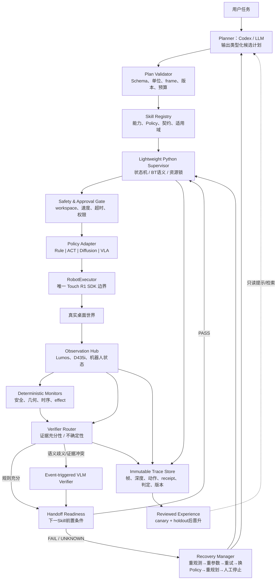

# 推荐可复用架构

## 1. 架构原则

1. ThirdHand 保持母体；不做完整 ROS 2 Agent 迁移。
2. Codex/LLM/VLM 只能提出类型化计划或语义判定，不能直接访问 Touch R1 SDK。
3. `RobotExecutor` 是唯一可导入/持有 SDK 的组件；安全门、限幅与资源锁位于模型权限之外。
4. command completion、world change、Skill effect、task success 分别取证。
5. 连续安全/几何检查使用确定性规则；VLM 仅在事件边界、语义歧义或证据冲突时调用。
6. 所有恢复有预算，失败闭合（fail closed），并保留人工停止与批准。

## 2. 推荐系统图

## 3. 模块来源与建设方式

| 模块 | 主要来源 | 直接复用 | 自己实现/保留 |
|---|---|---|---|
| Planner/Tool boundary | OpenETA、RAI、CaP | 可用 OpenAI-compatible/现有模型客户端思想 | ThirdHand typed plan adapter；不开放SDK工具 |
| Skill Registry/Contract | OpenETA、RAI、CLASP、ProgPrompt | schema库可选，概念与字段复用 | 适合Touch的contract、坐标/标定/安全字段 |
| Supervisor | BT.CPP语义、OpenETA bounded loop | 不引入完整C++/ROS runtime | 轻量Python FSM/BT-like supervisor |
| Rule-based Skill | 现有ThirdHand | 保留已有感知/状态机和SDK模块 | 修正现有P0问题后封装adapter |
| Learned Skill | LeRobot、ACT、Diffusion Policy | LeRobot数据/策略接口 | Touch robot/action/camera adapter与安全包装 |
| RobotExecutor | 现有ThirdHand | 原厂SDK | 单一权限边界、限幅、idempotency与receipt |
| Deterministic Monitor | Code-as-Monitor、现有视觉 | 几何/时序思路 | 真机predicate和阈值校准 |
| VLM Verifier | Inner Monologue、DoReMi、LERa | prompt/structured output思想 | 事件触发、UNKNOWN、证据包与离线校准 |
| Handoff Checker | Semantic Handoff | clean-vs-chained评测设计 | 真实Touch readiness predicates与数据集 |
| Recovery | BT、PLanAR、OpenETA | Retry/Fallback/Timeout语义 | 风险/预算敏感恢复策略 |
| Trace/Memory | REFLECT、OpenETA、ASPIRE、ENPIRE | event/evidence/晋升原则 | 不可变本地trace、隐私/存储与版本策略 |
| 外部研究基线 | OpenETA、CaP-X、HELIX | 隔离运行 | trace转换器与公平评测协议（后续） |

## 4. 核心接口（设计，不是实现代码）

| 接口 | 输入 | 输出 | 不变量 |
|---|---|---|---|
| `Planner.propose` | 用户目标、只读world summary、registry摘要、剩余预算 | 版本化typed plan或clarification | 无SDK句柄；不能修改registry/safety |
| `PlanValidator.validate` | plan、schema、calibration/policy versions | accepted或结构化拒绝原因 | 缺单位/frame/版本即拒绝 |
| `Skill.precheck` | 参数、fresh observation、robot state | PASS/FAIL/UNKNOWN + evidence refs | 不改变世界 |
| `Skill.execute` | validated command、budget、capability token | command receipt + trace refs | 只有RobotExecutor可产生副作用 |
| `Monitor.observe` | 同步/标记异步观测、expected effects | predicates + confidence/validity | 不以旧帧证明新effect |
| `Verifier.verify` | effect/readiness query、evidence bundle | PASS/FAIL/UNKNOWN + rationale refs | VLM文本不能覆盖硬安全FAIL |
| `Recovery.decide` | failure class、可逆性、历史、预算 | 下一恢复动作或human stop | 次数/时间/世界变化预算单调减少 |
| `Experience.promote` | trace集合、review、canary、holdout结果 | 版本化hint/Skill candidate | 单次成功不可直接晋升 |

## 5. 控制频率与模型位置

- SDK/安全/连续监控：本地确定性路径，频率由硬件与传感器决定。
- Skill phase boundary：Supervisor 检查 effect 与 readiness。
- VLM：只在触发事件上异步/有超时调用；超时为 UNKNOWN，不能绕过安全门。
- Planner/Codex：任务开始、世界状态使计划失效、或恢复升级到 replan 时调用；不承担伺服控制。

## 6. 状态机最小语义

`IDLE → OBSERVE → VALIDATE → PRECHECK → APPROVAL → EXECUTE → VERIFY_EFFECT → VERIFY_HANDOFF → NEXT/DONE`。任何阶段可进入 `RECOVER`；安全/预算/证据不足可进入 `HUMAN_STOP`。只有 task-level verifier 能进入 `DONE`，SDK 的 `command_complete` 只能离开 `EXECUTE`。

## 7. 为什么不选 PDDL / 完整 BT / 完整 ROS 2

- PDDL 增加 domain建模但不解决视觉证据、坐标/标定和真机执行语义；短任务收益小。
- BehaviorTree.CPP 很成熟，但 C++运行时/节点集成成本不创造论文证据；借语义即可。
- ROS 2/MoveIt/RAI 的长期互操作性好，但 Touch R1 当前缺少已验证的完整驱动/URDF/TF/控制链；两个月内应先稳定 Python闭环。

## 8. 未来可替换性

只要保持 Observation、SkillContract、CommandReceipt、VerificationResult 和 TraceEvent 五个边界，后续可把 rule policy 换成 LeRobot ACT/DP，把轻量 planner 换成 OpenETA/RAI，把执行后端迁到 ROS 2/MTC，而不重写研究指标。真正应稳定的是证据/安全/交接契约，不是某一模型或框架。
