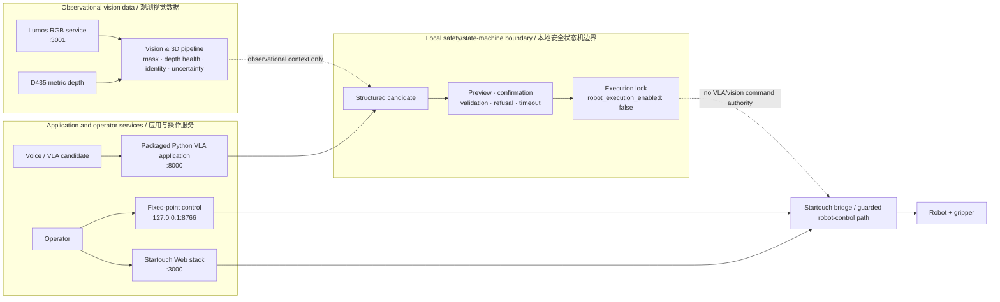

<div align="center">

# ThirdHand VLA

**A safety-bounded research platform for visual/3D robotic perception, verifiable VLA candidates, and reproducible evidence.**<br>
**面向视觉/三维机器人感知、可验证 VLA 候选与可复现实验证据的安全边界研究平台。**

[](pyproject.toml)
[](LICENSE)

[](.github/workflows)

**[中文教程 / Chinese tutorial](README_CN.md)** · **[English tutorial](README_EN.md)**

</div>

> **Safety status / 安全状态：** Online vision is observational; the checked-in
> configuration keeps `robot_execution_enabled: false`. No result in this repository
> validates vision-triggered robot motion. 在线视觉仅用于观测；仓库配置保持
> `robot_execution_enabled: false`，没有任何结果证明视觉触发的机器人运动已经验收。

## Research focus / 研究主轴

| Track | What the repository supports now | Research position |
| --- | --- | --- |
| **Vision & 3D / 视觉与三维** | Lumos RGB, D435 depth health, instance masks, identity memory, uncertainty-aware gating, and read-only online observation. | **Primary / 主轴** — calibrated 3D and comparative study evidence remain incomplete. |
| **Verifiable VLA / 可验证 VLA** | Structured candidates, local preview, confirmation, deterministic validation, refusal, timeout, and recovery interfaces. | **Secondary / 次轴** — candidate generation is not robot authority. |
| **Safe Execution Platform / 安全执行平台** | Packaged console, Startouch web stack, fixed-point demo, safety/state-machine boundaries, and port separation. | **Platform / 平台** — a supervised boundary, not the paper's principal claim. |
| **Reproducible Evidence / 可复现实验证据** | Claim, dataset, baseline, figure, and reproducibility templates with machine-readable schemas. | **Evidence contract / 证据契约** — no planned figure is a result. |

### Maturity legend / 成熟度图例

| Level | Meaning |
| --- | --- |
| **Implemented / 已实现** | Code or documented interface exists in this repository. |
| **Verified / 已验证** | A linked, scoped test or dated measurement supports the stated behavior. |
| **Experimental / 实验性** | Usable for bounded research/Dry Run evaluation; not a validated general capability. |
| **Planned / 计划中** | A protocol, schema, or intended artifact exists, but no result is claimed. |

### Capability status / 能力状态

| Capability | Maturity | Repository evidence | Boundary / interpretation |
| --- | --- | --- | --- |
| Dual-camera perception and persistent identity | **Experimental** | [dated REMIND-3D deployment record](docs/vision_research/REMIND3D_DEPLOYMENT_RESULTS.md) | Lumos is canonical RGB; D435 supplies metric-depth health. Missing calibration keeps targets non-actionable. |
| Read-only online Dry Run | **Verified** | [2026-08-05 deployment record](docs/vision_research/REMIND3D_DEPLOYMENT_RESULTS.md) | The record states `robot_execution_enabled: false`; no CAN, Startouch, robot, or gripper I/O belongs to this vision path. |
| Candidate → preview → validation/refusal boundary | **Implemented** | [Verifiable VLA track](docs/research/README.md) | It constrains a proposed decision before robot authority; no VLA comparison result is represented. |
| Comparative figures and paper claims | **Planned** | [figure manifest](docs/research/figure_manifest.md) | Each listed figure needs source artifacts and a reproducible generation command. |

## Architecture / 系统边界



Vision observations inform candidates, but do not grant actuator authority. The local
boundary must produce preview, confirmation, validation, or refusal before any
separately supervised control path is considered. The tutorial's only L4 launch entry
point is the wrapper in its default manual mode:

```bash
bash scripts/demo_fixed_pick_place.sh
```

The command `bash scripts/open_fixed_pick_place_control.sh` opens the loopback
`127.0.0.1:8766` UI only for **Experimental audit-only / 仅限实验审计** inspection;
it is not a tutorial or safe L4 entry point. Its `/api/start-auto` route lacks an
implementation-level fail-closed gate, so do not run the command or use the UI for
real L4 motion. Do not run competing CAN controllers.

该页面不得用于真实 L4 运动，仅推荐上述默认 `manual` 包装脚本；不要运行竞争的
CAN 控制器。

See [architecture details](docs/architecture.md),
[fixed-point safety instructions](web-control/FIXED_PICK_PLACE.md), and the detailed
[Chinese](README_CN.md#tutorial-07-hands-on) / [English](README_EN.md#tutorial-07-hands-on)
L4 tutorials.

## Safe quick start / 安全快速开始

Python 3.10+ is required. This is the shortest offline L0/L1 verification path:

```bash
git clone https://github.com/Chenxi-Li24/UIEAclub_ThirdHand_VLA.git
cd UIEAclub_ThirdHand_VLA
python3 -m venv .venv
. .venv/bin/activate
python -m pip install --upgrade pip
pip install -e ".[core,dev]"
ruff check src/ tests/
mypy src/
STARTOUCH_CAN_INTERFACE=thirdhand-test pytest tests/ -q --ignore=tests/e2e/
```

These commands install and test local software only; they **do not authorize hardware
motion**. Keep the physical emergency stop available before any separately approved
hardware procedure. For service-specific setup, read the [architecture](docs/architecture.md),
[web-control guide](web-control/README.md), and [model/runtime-data notes](docs/model_assets.md).

## Evidence preview / 证据预览

The [research evidence hub](docs/research/README.md) separates measured records from
future artifacts. `Planned Evidence / 待补实验证据` means no result exists.
`Evidence Incomplete / 待补充证据` is reserved for a partial result whose sample
count, confidence interval, statistical method, or source evidence is absent,
inadequate, or untraceable. Protocol readiness is recorded separately from evidence
status.

### Planned figure registry / 计划图表登记

All entries below are **Planned Evidence**: they are future artifacts, not measurements, and no
result exists for any row. The [full figure manifest](docs/research/figure_manifest.md) is the
canonical release contract.

| ID | Intended content | Status | Required source data | Required generation command | Release gate |
| --- | --- | --- | --- | --- | --- |
| V1 | Lumos instance mask, D435 depth, and robot-base 3D view. <code>content:v1:mask-depth-base3d</code> | Planned Evidence | Timestamped Lumos RGB, D435 depth, calibration ID/hash, instance masks, registered 3D points, experiment manifest. <code>source:v1:rgb-depth-calibration-mask-points</code> | Versioned script/command that joins frames by manifest, applies the recorded calibration, and renders the selected samples. <code>generator:v1:manifest-calibrated-panel</code> | Source manifest and command reproduce the panel without manual image editing. <code>gate:v1:reproducible-no-manual-edit</code> |
| V2 | Identity before occlusion, during occlusion, and after reacquisition. <code>content:v2:occlusion-reacquisition-identity</code> | Planned Evidence | Ordered replay frames, detections/masks, track IDs, association scores, memory state, occlusion annotations, experiment manifest. <code>source:v2:replay-tracks-memory-annotations</code> | Versioned script/command that selects declared clips and renders the three states from result records. <code>generator:v2:declared-clips-three-states</code> | Clip split is held out and identity labels/selection rule are recorded. <code>gate:v2:heldout-identity-selection</code> |
| V3 | Depth-registration error, radial calibration residuals, and uncertainty view. <code>content:v3:registration-residual-uncertainty</code> | Planned Evidence | Calibration targets, correspondence/residual records, radial-bin metadata, registration errors, covariance/uncertainty records, manifest. <code>source:v3:calibration-correspondence-covariance</code> | Versioned script/command that aggregates source JSON/CSV into residual, error, and uncertainty panels. <code>generator:v3:aggregate-residual-error-uncertainty</code> | Units, aggregation, calibration ID, and excluded samples are reported. <code>gate:v3:units-aggregation-calibration-exclusions</code> |
| L1 | VLA instruction, visual context, candidate, preview, confirmation, and refusal reason. <code>content:l1:instruction-candidate-preview-refusal</code> | Planned Evidence | De-identified scenario input, visual-context reference, structured candidate, preview output, confirmation event, validator/refusal log, manifest. <code>source:l1:scenario-context-candidate-validator-log</code> | Versioned script/command that renders the complete auditable decision trace from logs. <code>generator:l1:auditable-decision-trace</code> | No secret, personal, or misleading actuator-success claim appears in the trace. <code>gate:l1:no-secrets-or-actuator-success-claim</code> |
| E1 | Baseline comparison and confidence intervals. <code>content:e1:baseline-confidence-intervals</code> | Planned Evidence | Result records for all preregistered baselines, sample counts, intervals, slices, source CSV/JSON, manifests. <code>source:e1:preregistered-results-intervals-slices</code> | Versioned script/command that reads result records and computes/plots declared aggregate and confidence intervals. <code>generator:e1:aggregate-confidence-interval-plot</code> | Baselines, split, interval method, and exclusions match the matrix. <code>gate:e1:baseline-split-interval-exclusions</code> |
| E2 | Ablation table/curve. <code>content:e2:ablation-table-curve</code> | Planned Evidence | Controlled-variant result records, variant configuration, seeds, slices, source CSV/JSON, manifests. <code>source:e2:controlled-variants-seeds-results</code> | Versioned script/command that groups variants and produces the declared table or curve. <code>generator:e2:grouped-variant-table-curve</code> | One-delta ablation rule and all controls are documented. <code>gate:e2:one-delta-controls</code> |
| E3 | Accuracy-latency-resource trade-off. <code>content:e3:accuracy-latency-resource</code> | Planned Evidence | Accuracy, P50/P95 latency, FPS, CPU/GPU/VRAM records, hardware/environment manifests, source CSV/JSON. <code>source:e3:metrics-environment-manifest</code> | Versioned script/command that joins metrics by experiment ID and renders trade-off points/error bars. <code>generator:e3:experiment-metric-tradeoff</code> | Hardware, batch/input settings, and aggregation window are comparable. <code>gate:e3:comparable-hardware-window</code> |
| F1 | Representative success and failure cases. <code>content:f1:representative-success-failure</code> | Planned Evidence | Declared case-selection rule, scenario/clip IDs, input/output traces, failure taxonomy, manifests. <code>source:f1:selection-traces-failure-taxonomy</code> | Versioned script/command that applies the selection rule and renders paired success/failure cases. <code>generator:f1:selection-rule-paired-cases</code> | Selection is not cherry-picked; limitations and refusal/failure context are visible. <code>gate:f1:no-cherry-pick-limitations-visible</code> |

### Dated measured deployment records / 已链接的日期测量记录

These scoped observations are not comparative paper results and do not authorize
robot execution. They are included only because the linked deployment report records
the measurements and date.

| Date | Measured record | Source |
| --- | --- | --- |
| 2026-08-05 | Dual-camera online Dry Run: 1,801 samples over 1,800 seconds; zero errors and zero samples with execution enabled. | [REMIND-3D deployment results](docs/vision_research/REMIND3D_DEPLOYMENT_RESULTS.md) |
| 2026-08-05 | Real Lumos GPU smoke: six instance masks; p95 latency 48.893 ms; `robot_execution_enabled=false`. | [REMIND-3D deployment results](docs/vision_research/REMIND3D_DEPLOYMENT_RESULTS.md) |
| 2026-08-05 | Deterministic identity replay: five frames, zero ID switches, one ambiguous observation, and zero forced ambiguous assignments. | [REMIND-3D deployment results](docs/vision_research/REMIND3D_DEPLOYMENT_RESULTS.md) |

## Repository map / 仓库导航

| Path | Role |
| --- | --- |
| [`src/uiea_thirdhand_vla/`](src/uiea_thirdhand_vla/) | Installable Python VLA application and FastAPI console (`:8000`) |
| [`web-control/`](web-control/) | Startouch bridge, camera services, and operator UI (`:3000`; Lumos RGB `:3001`) |
| [`configs/`](configs/) | Robot, camera, task, and vision configuration |
| [`scripts/`](scripts/) | Calibration, deployment, demo, and validation entry points |
| [`tests/`](tests/) | Offline application and workflow tests |
| [`docs/research/`](docs/research/) | Research evidence contracts, schemas, and planned figure registry |

## License

MIT — see [LICENSE](LICENSE).
