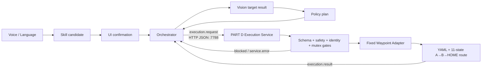

# PART D / Execution（Robot Control）中文接入说明

## 0. 结论先看

本交付已经提供一个供 Orchestrator 调用的本机 HTTP/JSON Execution 服务，默认并按本次团队约定使用端口 `7788`。它当前可以安全完成：

- `simulate`：校验合同、YAML 和固定 A-to-B 路线，并模拟遍历 11 个软件状态；
- `dry-run`：只做本地合同、配置、文件和路线预检，不启动 Bridge、SDK 或 CAN；
- 对不支持的计划、错误字段、并发请求和 `real` 请求 fail closed；启用 Orchestrator identity binding 后，身份不一致也会 fail closed；
- 返回符合团队合同的 `execution.result`；HTTP/JSON 协议级错误返回 `service.error`。

本交付**不能让机械臂真实运动**。`real` 模式被硬阻止；交付和测试过程中没有连接 Bridge、SDK、CAN、SSH 或机械臂，也没有发送 motion/gripper command。真实硬件运动需要后续单独开发、现场授权和安全验收。

## 1. 端口与接口

| 项目 | 当前值 |
| --- | --- |
| 协议 | HTTP/1.1 + UTF-8 JSON |
| 监听地址 | `127.0.0.1`，仅本机回环地址 |
| 端口 | `7788` |
| Health | `GET http://127.0.0.1:7788/health` |
| Capabilities | `GET http://127.0.0.1:7788/v1/capabilities` |
| Execution | `POST http://127.0.0.1:7788/v1/execution` |
| 请求体上限 | 1 MiB |
| HTTP body 读取超时 | 5 秒 |
| 并发策略 | 全局非阻塞互斥锁；同一时间只接纳一个执行请求 |
| 忙碌行为 | HTTP 409，返回 `status=blocked` 且 `executedSteps=0` |
| 认证 | 无；安全边界是只允许 `127.0.0.1` |

重要说明：Orchestrator 必须运行在**同一台电脑**上，才能直接访问 `127.0.0.1:7788`。当前服务会拒绝绑定 `0.0.0.0` 或其他非回环地址。不要为了远程调用私自改成公网/局域网监听；如果将来必须跨机器通信，应由团队另外设计带认证和安全控制的网关。

## 2. 文件存储位置

### 2.1 当前开发电脑上的绝对路径

| 内容 | 本机路径 |
| --- | --- |
| 本地仓库 | `/Users/Mihail/Library/Mobile Documents/com~apple~CloudDocs/XJTLU/UIEA/Control skill/UIEAclub_ThirdHand_VLA` |
| Part D 交付说明与证据 | `/Users/Mihail/Library/Mobile Documents/com~apple~CloudDocs/XJTLU/UIEA/Control skill/UIEAclub_ThirdHand_VLA/part_d_execution_handoff` |
| 团队共享合同 | `/Users/Mihail/Library/Mobile Documents/com~apple~CloudDocs/XJTLU/UIEA/Control skill/contracts` |
| 本地分支 | `control-fixed-a-to-b` |
| 实现基线 commit | `dfa5dd3765267d56322f2a3a8d874bc556af4969` |
| 测试证据记录 commit | `be6e01dba1f6e4f829f6052ac6185853a0612791` |

绝对路径只说明本机现在存在哪里。Orchestrator 拿到代码后，应使用下面的**仓库相对路径**，不能依赖 Mihail 电脑上的绝对路径。

上述分支和 commit 当前都只存在于本地，分支没有 upstream，尚未 push 到 GitHub。Orchestrator 现在不能直接从 GitHub 拉取它；必须接收完整仓库压缩包或 git bundle，或者等待负责人明确授权后再把现有分支推送到远端。

### 2.2 仓库内必须配套交付的相对路径

| 作用 | 仓库相对路径 |
| --- | --- |
| HTTP 服务入口 | `web-control/server/startouch_execution_service.py` |
| Execution adapter | `web-control/scripts/startouch_fixed_waypoint_adapter.py` |
| 复用的固定路线 loader/runner | `web-control/scripts/fixed_pick_place.py` |
| 现有唯一硬件 Bridge 参考 | `web-control/server/startouch_bridge.py` |
| 固定路线配置 | `configs/tasks/fixed_pick_place.yaml` |
| Python 依赖 | `requirements/control-adapter.txt` |
| 环境变量示例 | `.env.example` |
| Adapter 单元测试 | `tests/control/test_startouch_fixed_waypoint_adapter.py` |
| HTTP 服务测试 | `tests/control/test_startouch_execution_service.py` |
| 交付包验证测试 | `tests/control/test_part_d_handoff.py` |
| 合同请求/结果样例与证据 | `part_d_execution_handoff/` |

### 2.3 `part_d_execution_handoff/` 能否单独运行

不能。这个目录主要包含交付说明、manifest、JSON 样例和测试证据；实际服务代码、adapter、YAML、依赖和测试在同一仓库的其他目录中。

因此交付给 Orchestrator 时应采用以下任一方式：

1. 推荐：提供完整仓库的 `control-fixed-a-to-b` 分支；或
2. 离线交付：压缩完整仓库，而不是只压缩 `part_d_execution_handoff/`。

团队共享 `contracts/schema.json` 目前在仓库同级的 `../contracts/`。它不在当前 Git 分支中，因此 Orchestrator 还必须取得同一版本的团队 `contracts/`，并把 `THIRDHAND_CONTRACT_SCHEMA` 指向权威 `schema.json`，或按约定放在仓库的 `contracts/schema.json` / `../contracts/schema.json`。

## 3. 整体链路

团队逻辑链路是：

```text
Voice / Language
  -> skill.candidate
  -> UI 用户确认
  -> confirmation.decision
  -> Orchestrator
  -> Vision 目标确认
  -> Policy 执行计划
  -> Orchestrator 组装 execution.request
  -> POST http://127.0.0.1:7788/v1/execution
  -> PART D HTTP Service
  -> 合同、安全、身份、模式和互斥检查
  -> Fixed Waypoint Adapter
  -> YAML 与 11 状态路线检查
  -> execution.result / service.error
  -> Orchestrator
```



PART D 只接受 `source=orchestrator`、`target=robot` 的 `execution.request`。Voice、Language、Vision、Policy 或 UI 不应绕过 Orchestrator 直接要求机械臂执行。

## 4. 输入从哪里来

输入必须由 Orchestrator 根据上游确认、Vision 和 Policy 结果组装。可回放的输入样例在：

- `part_d_execution_handoff/examples/execution_request_simulate.json`
- `part_d_execution_handoff/examples/execution_request_dry_run.json`
- `part_d_execution_handoff/examples/execution_request_unsupported_plan.json`
- `part_d_execution_handoff/examples/execution_request_unconfirmed.json`（故意无效的负例）

其中 `execution_request_unconfirmed.json` 不是可发送的正常合同消息。共享 Schema 把 `confirmed` 定义为 `const: true`，所以 `confirmed=false` 天生无法通过 Schema；保留该文件只是为了证明 adapter 会 fail closed。正常 Orchestrator 请求必须先通过 Schema，并且只能发送 `confirmed=true`。

核心输入字段包括：

- 消息链：`messageId`、`sessionId`、`traceId`、`candidateId`、`decisionId`、`targetId`；
- 调用边界：`source=orchestrator`、`target=robot`；
- 执行模式：`simulate`、`dry-run` 或 `real`；
- 用户确认：`confirmed=true`；
- 执行计划：`executionPlan.kind`、`planId`、`adapterId`、`routeStates`；
- 安全门：唯一目标、画面新鲜度、互斥运动、物理 E-stop、`speedScale`。

单条 `execution.request` 只携带 ID 和安全布尔值，并不包含完整上游消息本身。因此 Part D 无法仅凭一条请求独立证明 candidate/decision/target/trace 的跨消息一致性，也无法独立测量 Vision 帧是否真的新鲜。

如果 Orchestrator 需要 Part D 再做一次状态化身份核对，可维护 `sessionId -> traceId/candidateId/decisionId/targetId` 的只读 JSON 文件，并设置：

```bash
export THIRDHAND_EXECUTION_BINDINGS_FILE=/absolute/path/to/identity_bindings.json
```

格式参考 `part_d_execution_handoff/config/identity_bindings.example.json`。若启用后 session 缺失或任一 ID 不一致，请求会被阻止。

## 5. 当前实现

### 5.1 HTTP 服务层

`web-control/server/startouch_execution_service.py` 实现：

- 只允许监听 `127.0.0.1`；默认及本次约定端口为 `7788`，代码也允许显式选择其他本机端口；
- 提供 health、capabilities 和 execution 三个 endpoint；
- 严格读取 JSON，限制 body 大小和读取时间；
- HTTP/JSON 协议错误返回 `service.error`，且 `payload.stage=execution`；
- Schema 无效的 `execution.request` 按当前交付兼容行为返回 `status=blocked` 的合同结果；
- 使用一个全局非阻塞锁阻止并发运动请求；
- 可选读取 Orchestrator 提供的身份 binding；
- 不启动 Bridge、不加载 Startouch SDK、不打开 CAN、不访问 SSH。

### 5.2 Fixed Waypoint Adapter

`web-control/scripts/startouch_fixed_waypoint_adapter.py` 实现：

- 按团队 `schema.json` 校验输入和输出；
- 只接受 `startouch_fixed_waypoint_adapter_v1`；
- 只接受 `fixed_waypoint_a_to_b`；
- 校验固定 `bridgeRef`、`configRef`、路线、模式和安全门；
- 通过现有 `fixed_pick_place.py` 的配置加载能力读取 YAML；
- 生成新的 result `messageId`，保留 request 的 `mode`、`sessionId`、`traceId`、`candidateId`，并设置 `replyTo=request.messageId`；
- 把 `planId` 映射为输出的 `sequenceId`；
- 不支持的 adapter、`act_chunk`、错误速度、错误路线和 `real` 均 fail closed。

### 5.3 固定路线

当前只校验以下 11 个状态，并在 HOME 停止：

```text
OPEN_GRIPPER_READY
-> MOVE_HOME_START
-> APPROACH_A_UP
-> DESCEND_TO_A_PICK
-> ADAPTIVE_GRASP_A
-> LIFT_A
-> TRANSFER_A_UP_TO_B_UP
-> DESCEND_TO_B
-> RELEASE_AT_B
-> LIFT_AFTER_RELEASE_B
-> RETURN_B_UP_TO_HOME
```

不会进入 `MOVE_HOME_TO_B_UP`，也不会执行 B-to-A 返回半程。固定计划和 YAML 的 `speedScale` 必须为 `0.15`。

### 5.4 Bridge 边界

现有唯一硬件边界仍是 `web-control/server/startouch_bridge.py`。本交付只检查该文件引用存在，**没有启动它**。未来真实硬件接入也必须复用现有 `BridgeClient` 和 Bridge，不能再建立第二套 SDK/CAN owner，不能让 adapter 直接绕过 Bridge 调用厂商 SDK。

## 6. 三种模式的真实含义

| 模式 | 当前结果 | 是否接触硬件 | `executedSteps` 含义 |
| --- | --- | --- | --- |
| `simulate` | 支持 | 否 | `11` 表示检查了 11 个软件路线状态，不代表机械臂移动了 11 步 |
| `dry-run` | 支持本地无运动预检 | 否 | `0`，因为没有实际运动，也没有向 Bridge 提交逻辑运动命令 |
| `real` | 始终 blocked | 否 | `0` |

`dry-run` 成功只证明合同、配置、路径和路线能在本地通过预检；它不证明 Bridge/SDK/CAN 可达，不证明机器人状态正常，也不证明能抓到瓶子。

## 7. Orchestrator 接入步骤

以下命令都从仓库根目录执行。

### 步骤 1：准备权威合同

确保以下任一路径存在：

```text
contracts/schema.json
../contracts/schema.json
```

或者显式指定：

```bash
export THIRDHAND_CONTRACT_SCHEMA=/absolute/path/to/contracts/schema.json
```

显式路径错误时服务会 fail closed，不会静默使用另一个 schema。

### 步骤 2：创建独立 Python 环境

```bash
python3.12 -m venv .venv-control
.venv-control/bin/python -m pip install -r requirements/control-adapter.txt
```

### 步骤 3：启动服务

```bash
.venv-control/bin/python web-control/server/startouch_execution_service.py \
  --host 127.0.0.1 --port 7788
```

### 步骤 4：只读健康检查

```bash
curl --fail --silent http://127.0.0.1:7788/health
curl --fail --silent http://127.0.0.1:7788/v1/capabilities
```

预期 health 中以下字段均表示没有硬件访问：

```json
{
  "hardwareAccess": false,
  "bridgeStarted": false,
  "sdkInitialized": false,
  "canOpened": false,
  "motionCommandsEnabled": false
}
```

### 步骤 5：回放 `simulate`

```bash
curl --fail --silent \
  --header 'Content-Type: application/json' \
  --data @part_d_execution_handoff/examples/execution_request_simulate.json \
  http://127.0.0.1:7788/v1/execution
```

成功结果应包含：`mode=simulate`、`status=success`、`executedSteps=11`、`hardwareFeedbackVerified=false`。`bridgeEvidence.bridgeRef` 只是固定文件引用；验证标志为 `false`、命令计数为 `0`、最终状态引用为 `null`。

### 步骤 6：回放本地无运动 `dry-run`

```bash
curl --fail --silent \
  --header 'Content-Type: application/json' \
  --data @part_d_execution_handoff/examples/execution_request_dry_run.json \
  http://127.0.0.1:7788/v1/execution
```

成功结果应包含：`mode=dry-run`、`status=success`、`executedSteps=0`、`hardwareFeedbackVerified=false`。结果会保留固定的 `bridgeRef` 文件引用，但没有 Bridge/SDK/CAN 验证证据：验证标志为 `false`、命令计数为 `0`、最终状态引用为 `null`。

### 步骤 7：停止服务

在启动服务的终端按 `Ctrl-C`。只停止这个 Part D HTTP 进程；不要为了上述测试启动或停止 `startouch_bridge.py`。

### 步骤 8：运行测试

```bash
PYTHONPATH=src .venv-control/bin/python -m pytest -q -p no:cacheprovider \
  tests/control/test_startouch_fixed_waypoint_adapter.py \
  tests/control/test_startouch_execution_service.py \
  tests/control/test_part_d_handoff.py
```

本次交付记录的结果是 `44 passed, 0 failed`。证据位于：

- `part_d_execution_handoff/evidence/test_report.md`
- `part_d_execution_handoff/evidence/simulate_smoke_test.log`
- `part_d_execution_handoff/evidence/dry_run_smoke_test.log`

## 8. Orchestrator 需要怎样调用

1. Orchestrator 完成上游 candidate、用户确认、Vision 目标和 Policy 计划的关联检查。
2. Orchestrator 生成合同有效的 `execution.request`。
3. Orchestrator 向 `http://127.0.0.1:7788/v1/execution` 发出 HTTP POST。
4. Orchestrator 验证返回消息：
   - `replyTo` 等于请求的 `messageId`；
   - `sessionId`、`traceId`、`mode` 和 `candidateId` 正确继承；
   - `sequenceId` 等于输入 `planId`；
   - `status`、`error`、`executedSteps`、`hardwareFeedbackVerified` 和 `bridgeEvidence` 与模式一致。
5. 如果收到 `blocked`、`failure` 或 `service.error`，Orchestrator 不得自动改成 `real` 重试，也不得绕过 Part D 直接调用 Bridge。

## 9. 已完成与未完成

### 已完成，可交给 Orchestrator 做软件联调

- 端口 `7788` 的 loopback HTTP/JSON 接口；
- `execution.request -> execution.result/service.error`；
- `startouch_fixed_waypoint_adapter_v1`；
- `fixed_waypoint_a_to_b` 的 11 状态 A-to-B-to-HOME 软件路线；
- `simulate`；
- 本地无运动 `dry-run`；
- Schema、字段、路线、速度、安全布尔门和并发互斥校验；
- 可选跨消息 ID binding；
- 44 个聚焦测试及 fresh smoke-test 证据；
- 失败路径 fail closed，未触发真实运动。

### 未完成，不能声称机械臂已经可正常运动

- `startouch_action_chunk_adapter_v1`；
- ACT `act_chunk` 执行；
- Bridge/SDK/CAN 可达性与只读状态验证；
- 真机 `real` 模式；
- 真实 motion/gripper command；
- 物理 E-stop 的现场验证；
- 实际 frame freshness/唯一目标证据的独立验证；
- 真实 Bridge event、机器人反馈、CAN 故障和 timeout 证据；
- 物理抓取可用性、精度和成功率验收。

## 10. 安全要求

- 当前只允许 `simulate` 和本地无运动 `dry-run`。
- 不要把 `executedSteps=11` 解释为机械臂运动。
- 不要把 software stop 解释为物理 E-stop。
- 不要把 synthetic fault-injection 测试解释为观察到的真实硬件故障。
- 不要通过 Voice、UI 或 Policy 绕过 Orchestrator 直接执行。
- 不要启动第二套 SDK/CAN owner。
- 未经现场负责人单独明确授权，不得解锁 `real`、发送运动或夹爪命令。

## 11. Orchestrator 接收检查表

- [ ] 已取得完整仓库分支或完整离线仓库，不只是 `part_d_execution_handoff/`。
- [ ] 已取得并锁定同一版本的权威 `contracts/schema.json`。
- [ ] 已确认入口为 `web-control/server/startouch_execution_service.py`。
- [ ] 已确认 endpoint 为 `http://127.0.0.1:7788/v1/execution`。
- [ ] `GET /health` 返回且硬件相关字段全部为 false。
- [ ] `simulate` 样例成功，并返回 11 个软件状态。
- [ ] `dry-run` 样例成功，并返回 0 个执行步骤。
- [ ] blocked/failure 时没有伪造硬件反馈。
- [ ] 已决定是否由 Orchestrator 提供 identity binding 文件。
- [ ] 已接受当前不支持 ACT 和真实机械臂运动的限制。

更完整的字段映射、失败行为和证据说明见同目录的 `DELIVERY.md` 与 `delivery_manifest.json`。
